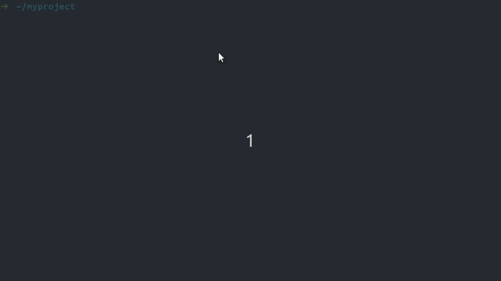

# Log4brains <!-- omit in toc -->

<p align="center">
  <a href="#readme">
    
  </a>
</p>

<p align="center">
  <a href="https://github.com/thomvaill/log4brains/blob/master/LICENSE">
    
  </a>
  <a href="https://github.com/thomvaill/log4brains/actions?query=workflow%3ABuild">
    
  </a>
  <a href="https://github.com/thomvaill/log4brains/releases">
    
  </a>
  <a href="https://github.com/thomvaill/log4brains/releases">
    
  </a>
</p>

Log4brains is a docs-as-code knowledge base for your development and infrastructure projects.
It enables you to write and manage [Architecture Decision Records](https://adr.github.io/) (ADR) right from your IDE, and to publish them automatically as a static website.

<details>
<summary>Features</summary>
<p>

- Docs-as-code: ADRs are written in markdown, stored in your git repository, close to your code
- Local preview with Hot Reload
- Interactive ADR creation from the CLI
- Static site generation to publish to GitHub/GitLab Pages or S3
- Timeline menu
- Searchable
- ADR metadata automatically guessed from its raw text and git logs
- No enforced markdown structure: you are free to write however you want
- No required file numbering schema (i.e., `adr-0001.md`, `adr-0002.md`...): avoids git merge issues
- Customizable template (default: [MADR](https://adr.github.io/madr/))
- Multi-package projects support (mono or multi repo): notion of global and package-specific ADRs

**Coming soon**:

- Local images and diagrams support
- RSS feed to be notified of new ADRs
- Decision backlog
- `@adr` annotation to include code references in ADRs
- ADR creation/edition from the UI
- Create a new GitHub/GitLab issue from the UI
- ... let's [suggest a new feature](https://github.com/thomvaill/log4brains/issues/new?labels=feature&template=feature.md) if you have other needs!

</p>
</details>

<br />
<p align="center">
  <a href="https://thomvaill.github.io/log4brains/adr/">
    
  </a>
</p>
<p align="center">⚡ <strong>Demo</strong>: <a href="https://thomvaill.github.io/log4brains/adr/">Log4brains' own architecture knowledge base</a></p>

## Table of contents <!-- omit in toc -->

- [📣 BETA version: feedback is welcome!](#-beta-version-feedback-is-welcome)
- [🚀 Getting started](#-getting-started)
- [🤔 What is an ADR and why should you use them](#-what-is-an-adr-and-why-should-you-use-them)
- [💡 Why Log4brains](#-why-log4brains)
- [📨 CI/CD configuration examples](#-cicd-configuration-examples)
- [❓ FAQ](#-faq)
  - [What are the prerequisites?](#what-are-the-prerequisites)
  - [What about multi-package projects?](#what-about-multi-package-projects)
  - [What about non-JS projects?](#what-about-non-js-projects)
  - [How to configure `.log4brains.yml`?](#how-to-configure-log4brainsyml)
- [Contributing](#contributing)
- [Acknowledgments](#acknowledgments)
- [License](#license)

## 📣 BETA version: feedback is welcome!

At this stage, Log4brains is just a few months old and was designed only based on my needs and my past experiences with ADRs.
But I am convinced that this project can benefit a lot of teams.
This is why it would be precious for me to get your feedback on this beta version in order to improve it.

To do so, you are very welcome to [create a new feedback in the Discussions](https://github.com/thomvaill/log4brains/discussions/new?category=Feedback) or to reach me at <thomvaill@bluebricks.dev>. Thanks a lot 🙏

## 🚀 Getting started

According to the Log4brains philosophy, you should store your Architecture Decision Records (ADR) the closest to your code, which means ideally inside your project's git repository, for example in `<your project>/docs/adr`. In the case of a JS project, we recommend installing Log4brains as a dev dependency. To do so, run our interactive setup CLI inside your project root directory:

```bash
npx init-log4brains
```

... it will ask you several questions to get your knowledge base installed and configured properly. Click [here](#what-about-non-js-projects) for non-JS projects.

Then, you can start the web UI in local preview mode:

```bash
npm run log4brains-preview

# OR

yarn log4brains-preview
```

In this mode, the Hot Reload feature is enabled: any change
you make to a markdown file is applied live in the UI.

You can use this command to easily create a new ADR interactively:

```bash
npm run adr -- new

# OR

yarn adr new
```

Just add the `--help` option for more information on this command.

Finally, do not forget to [set up your CI/CD pipeline](#-cicd-configuration-examples) to automatically publish your knowledge base on a static website service like GitHub/GitLab Pages or S3.

## 🤔 What is an ADR and why should you use them

The term ADR become popular in 2011 with Michael Nygard's article: [documenting architecture decisions](https://cognitect.com/blog/2011/11/15/documenting-architecture-decisions). He aimed to reconcile Agile methods with software documentation by creating a very concise template
to record functional or non-functional "architecturally significant" decisions in a lightweight format like markdown.
The original template had only a few parts:

- **Title**: Which sums up the solved problem and its solution
- **Context**: Probably the essential part, which describes "the forces at play, including technological, political, social, and project local"
- **Decision**
- **Status**: Proposed, accepted, deprecated, superseded...
- **Consequences**: The positive and negative ones for the future of the project

Today, there are other ADR templates like [Y-Statements](https://medium.com/olzzio/y-statements-10eb07b5a177), or [MADR](https://adr.github.io/madr/), which is the default one that is configured in Log4brains.
Anyway, we believe that no template suits everyone's needs. You should adapt it according to your own situation.

As you can guess from the template above, an ADR is immutable. Only its status can change.
Thanks to this, your documentation is never out-of-date! Yes, an ADR can be deprecated or superseded by another one, but it was at least true one day!
And even if it's not the case anymore, it is still a precious piece of information.

This leads us to the main goals of this methodology:

- Avoid blind acceptance and blind reversal when you face past decisions
- Speed up the onboarding of new developers on a project
- Formalize a collaborative decision-making process

The first goal was the very original one, intended by Michael Nygard in his article.
I discovered the two others in my past experiences with ADRs, and this is why I decided to create Log4brains.

To learn more on this topic, I recommend you to read these great resources:

- [Documenting architecture decisions](https://cognitect.com/blog/2011/11/15/documenting-architecture-decisions), by Michael Nygard
- [ADR GitHub organization](https://adr.github.io/), home of the [MADR](https://adr.github.io/madr/) template, by @boceckts and @koppor
- [Collection of ADR templates](https://github.com/joelparkerhenderson/architecture_decision_record) by @joelparkerhenderson

## 💡 Why Log4brains

I've been using ADRs for a long time and, I often introduce this methodology to the teams I work with as a freelance developer.
It's always the same scenario: first, no one had ever heard about ADRs, and after using them for a while, they realize [how useful yet straightforward they are](#-what-is-an-adr-and-why-should-you-use-them). So one of the reasons I decided to start working on Log4brains was to popularize this methodology.

On the other hand, I wanted to solve some issues I encountered with them, like improving their discoverability or the poor tooling around them.
But above all, I am convinced that ADRs can have a broader impact than what they were intended for: speed up the onboarding on a project by becoming a training material, and become the support of a collaborative decision-making process.

In the long term, I see Log4brains as part of a global strategy that would let companies build and capitalize their teams' technical knowledge collaboratively.

## 📨 CI/CD configuration examples

Log4brains lets you publish automatically your knowledge base on the static hosting service of your choice, thanks to the `log4brains-web build` command.
Here are some configuration examples for the most common hosting services / CI runners.

<details>
<summary>Publish to GitHub Pages with GitHub Actions</summary>
<p>

First, create `.github/workflows/publish-log4brains.yml` and adapt it to your case:

```yml
name: Publish Log4brains
on:
  push:
    branches:
      - master
jobs:
  build-and-publish:
    runs-on: ubuntu-latest
    steps:
      - name: Checkout
        uses: actions/checkout@v2.3.4
        with:
          persist-credentials: false # required by JamesIves/github-pages-deploy-action
          fetch-depth: 0 # required by Log4brains to work correctly (needs the whole Git history)
      - name: Install Node
        uses: actions/setup-node@v1
        with:
          node-version: "14"
      # NPM:
      # (unfortunately, we cannot use `npm ci` for now because of this bug: https://github.com/npm/cli/issues/558)
      - name: Install and Build Log4brains (NPM)
        run: |
          npm install
          npm run log4brains-build -- --basePath /${GITHUB_REPOSITORY#*/}/log4brains
      # Yarn:
      # - name: Install and Build Log4brains (Yarn)
      #   run: |
      #     yarn install --frozen-lockfile
      #     yarn log4brains-build --basePath /${GITHUB_REPOSITORY#*/}/log4brains
      - name: Deploy
        uses: JamesIves/github-pages-deploy-action@3.7.1
        with:
          GITHUB_TOKEN: ${{ secrets.GITHUB_TOKEN }}
          BRANCH: gh-pages
          FOLDER: .log4brains/out
          TARGET_FOLDER: log4brains
```

After the first run, this workflow will create a `gh-pages` branch in your repository containing the generated static files to serve.
Then, we have to tell GitHub that we [don't want to use Jekyll](https://github.com/vercel/next.js/issues/2029), otherwise, you will get a 404 error:

```bash
git checkout gh-pages
touch .nojekyll
git add .nojekyll
git commit -m "Add .nojekyll for Log4brains"
git push
```

Finally, you can [enable your GitHub page](https://docs.github.com/en/free-pro-team@latest/github/working-with-github-pages/configuring-a-publishing-source-for-your-github-pages-site):

- On GitHub, go to `Settings > GitHub Pages`
- Select the `gh-pages` branch as the "Source"
- Then, select the `/ (root)` folder

You should now be able to see your knowledge base at `https://<username>.github.io/<repository>/log4brains/`.
It will be re-built and published every time you push on `master`.

</p>
</details>

<details>
<summary>Publish to GitLab Pages with GitLab CI</summary>
<p>

Create your `.gitlab-ci.yml` and adapt it to your case:

```yml
image: node:14-alpine3.12
pages:
  stage: deploy
  variables:
    GIT_DEPTH: 0 # required by Log4brains to work correctly (needs the whole Git history)
  script:
    - mkdir -p public
    # NPM:
    - npm install # unfortunately we cannot use `npm ci` for now because of this bug: https://github.com/npm/cli/issues/558
    - npm run log4brains-build -- --basePath /$CI_PROJECT_NAME/log4brains --out public/log4brains
    # Yarn:
    # - yarn install --frozen-lockfile
    # - yarn log4brains-build --basePath /$CI_PROJECT_NAME/log4brains --out public/log4brains
  artifacts:
    paths:
      - public
  rules:
    - if: "$CI_COMMIT_BRANCH == $CI_DEFAULT_BRANCH"
```

You should now be able to see your knowledge base at `https://<username>.gitlab.io/<repository>/log4brains/`.
It will be re-built and published every time you push on `master`.

</p>
</details>

<details>
<summary>Publish to S3</summary>
<p>

First, create a bucket with the "Static website hosting" feature enabled:

```bash
# This is an example: replace with the bucket name of your choice
export BUCKET_NAME=yourcompany-yourproject-log4brains

aws s3api create-bucket --acl public-read --bucket ${BUCKET_NAME}
read -r -d '' BUCKET_POLICY << EOP
{
  "Statement": [
    {
      "Effect": "Allow",
      "Principal": "*",
      "Action": "s3:GetObject",
      "Resource": "arn:aws:s3:::${BUCKET_NAME}/*"
    }
  ]
}
EOP
aws s3api put-bucket-policy --bucket ${BUCKET_NAME} --policy "$BUCKET_POLICY"
aws s3 website s3://${BUCKET_NAME} --index-document index.html
```

Then, configure your CI to run these commands:

- Install Node and the AWS CLI
- Checkout your Git repository **with the full history**. Otherwise, Log4brains won't work correctly (see previous examples)
- `npm install` or `yarn install --frozen-lockfile` to install the dev dependencies (unfortunately we cannot use `npm ci` for now because of this [bug](https://github.com/npm/cli/issues/558))
- `npm run log4brains-build` or `yarn log4brains-build`
- `aws s3 sync .log4brains/out s3://<YOUR BUCKET> --delete`

Your knowledge base will be available on `http://<YOUR BUCKET>.s3-website-<YOUR REGION>.amazonaws.com/`.
You can get some inspiration on implementing this workflow for GitHub Actions or GitLab CI by looking at the previous examples.

</p>
</details>

## ❓ FAQ

### What are the prerequisites?

- Node.js >= 10.23
- NPM or Yarn
- Your project versioned in Git ([not necessarily a JS project!](#what-about-non-js-projects))

### What about multi-package projects?

Log4brains supports both mono and multi packages projects. The `npx init-log4brains` command will prompt you regarding this.

In the case of a multi-package project, you have two options:

- Mono-repository: in this case, just install Log4brains in the root folder. It will manage "global ADRs", for example in `docs/adr` and "package-specific ADRs", for example in `packages/<package name>/docs/adr`.
- One repository per package: in the future, Log4brains will handle this case with a central repository for the "global ADRs" while fetching "package-specifics ADRs" directly from each package repository. For the moment, all the ADRs have to be stored in a central repository.

Here is an example of a typical file structure for each case:

<details>
<summary>Simple mono-package project</summary>
<p>

```
project-root
├── docs
|   └── adr
|       ├── 20200101-your-first-adr.md
|       ├── 20200115-your-second-adr.md
|       ├── [...]
|       ├── index.md
|       └── template.md
[...]
```

</p>
</details>

<details>
<summary>Multi-package project in a mono-repository</summary>
<p>

```
project-root
├── docs
|   └── adr
|       ├── 20200101-your-first-global-adr.md
|       ├── 20200115-your-second-global-adr.md
|       ├── [...]
|       ├── index.md
|       └── template.md
├── packages
|   ├── package1
|   |   ├── docs
|   |   |   └── adr
|   |   |       ├── 20200102-your-first-package-specific-adr.md
|   |   |       ├── 20200116-your-second-package-specific-adr.md
|   |   |       [...]
|   |   [...]
|   ├── package2
|   |   ├── docs
|   |   |   └── adr
|   |   |       ├── [...]
|   |   |       [...]
|   |   [...]
|   [...]
[...]
```

</p>
</details>

<details>
<summary>Multi-package with one repository per package</summary>
<p>

For the moment in one central repository (specific for the docs, or not):

```
project-docs
├── adr
|   ├── global
|   |   ├── 20200101-your-first-global-adr.md
|   |   ├── 20200115-your-second-global-adr.md
|   |   ├── [...]
|   |   ├── index.md
|   |   └── template.md
|   ├── package1
|   |   ├── 20200102-your-first-package-specific-adr.md
|   |   ├── 20200116-your-second-package-specific-adr.md
|   |   [...]
|   ├── package2
|   |   ├── [...]
|   |   [...]
|   [...]
[...]
```

In the future:

```
project-docs
├── adr
|   ├── 20200101-your-first-global-adr.md
|   ├── 20200115-your-second-global-adr.md
|   ├── [...]
|   ├── index.md
|   └── template.md
[...]

repo1
├── docs
|   └── adr
|       ├── 20200102-your-first-package-specific-adr.md
|       ├── 20200116-your-second-package-specific-adr.md
|       [...]
[...]

repo2
├── docs
|   └── adr
|       ├── [...]
|       [...]
[...]
```

</p>
</details>

### What about non-JS projects?

Even if Log4brains is developed with TypeScript and is part of the NPM ecosystem, it can be used for any kind of project, in any language.

For projects that do not have a `package.json` file, you have to install Log4brains globally:

```bash
npm install -g @log4brains-cli @log4brains-web
```

Create a `.log4brains.yml` file at the root of your project and [configure it](#how-to-configure-log4brainsyml).

You can now use these global commands inside your project:

- Create a new ADR: `log4brains adr new`
- Start the local web UI: `log4brains-web preview`
- Build the static version: `log4brains-web build`

### How to configure `.log4brains.yml`?

This file is usually automatically created when you run `npx init-log4brains` (cf [getting started](#-getting-started)), but you may need to configure it manually.

Here is an example with just the required fields:

```yaml
project:
  name: Foo Bar # The name that should be displayed in the UI
  tz: Europe/Paris # The timezone that you use for the dates in your ADR files
  adrFolder: ./docs/adr # The location of your ADR files
```

If you have multiple packages in your project, you may want to support package-specific ADRs by setting the optional `project.packages` field:

```yaml
project:
  # [...]
  packages:
    - name: backend # The name (unique identifier) of the package
      path: ./packages/backend # The location of its codebase
      adrFolder: ./packages/backend/docs/adr # The location of its ADR files
#   - ...
```

Another optional field is `project.repository`, which is normally automatically guessed by Log4brains to create links to GitHub, GitLab, etc. But in some cases, like for GitHub or GitLab enterprise, you have to configure it manually:

```yaml
project:
  #  [...]
  repository:
    url: https://github.com/foo/bar # Absolute URL of your repository
    provider: github # Supported providers: github, gitlab, bitbucket. Use `generic` if yours is not supported
    viewFileUriPattern: /blob/%branch/%path # Only required for `generic` providers
```

## Contributing

Pull Requests are more than welcome! Please read [CONTRIBUTING.md](CONTRIBUTING.md) for more details. You can also [create a new issue](https://github.com/thomvaill/log4brains/issues/new/choose) or [give your feedback](https://github.com/thomvaill/log4brains/discussions/new?category=Feedback).

## Acknowledgments

- [Next.js](https://github.com/vercel/next.js/), which is used under the hood to provide the web UI and the static site generation capability (look for `#NEXTJS-HACK` in the code to see the custom adaptations we had to make)
- Michael Nygard for all his work on [Architecture Decision Records](https://cognitect.com/blog/2011/11/15/documenting-architecture-decisions)
- @boceckts and @koppor for the [MADR](https://adr.github.io/madr/) template
- [Tippawan Sookruay](https://thenounproject.com/wanny4/) for the Log4brains logo
- @npryce, who inspired me for the CLI part with his [adr-tools](https://github.com/npryce/adr-tools) bash CLI
- @mrwilson, who inspired me for the static site generation part with his [adr-viewer](https://github.com/mrwilson/adr-viewer)

## License

This project is licensed under the Apache 2.0 license, Copyright (c) 2020 Thomas Vaillant. See the [LICENSE](LICENSE) file for more information.
